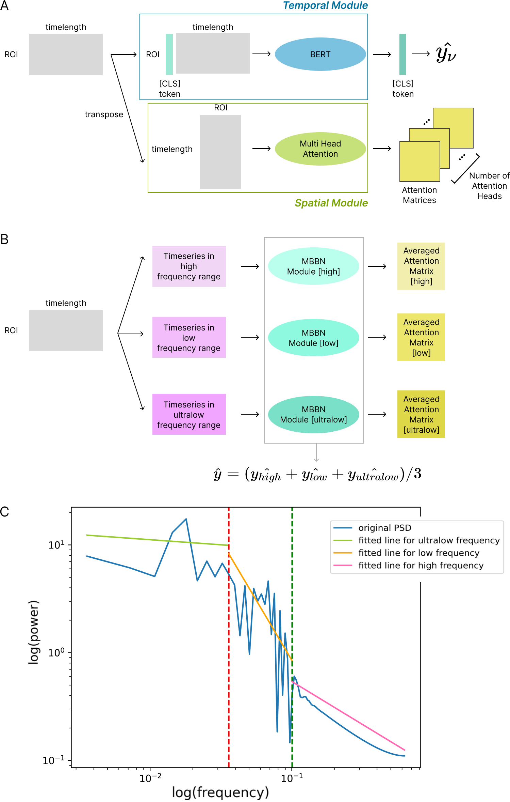
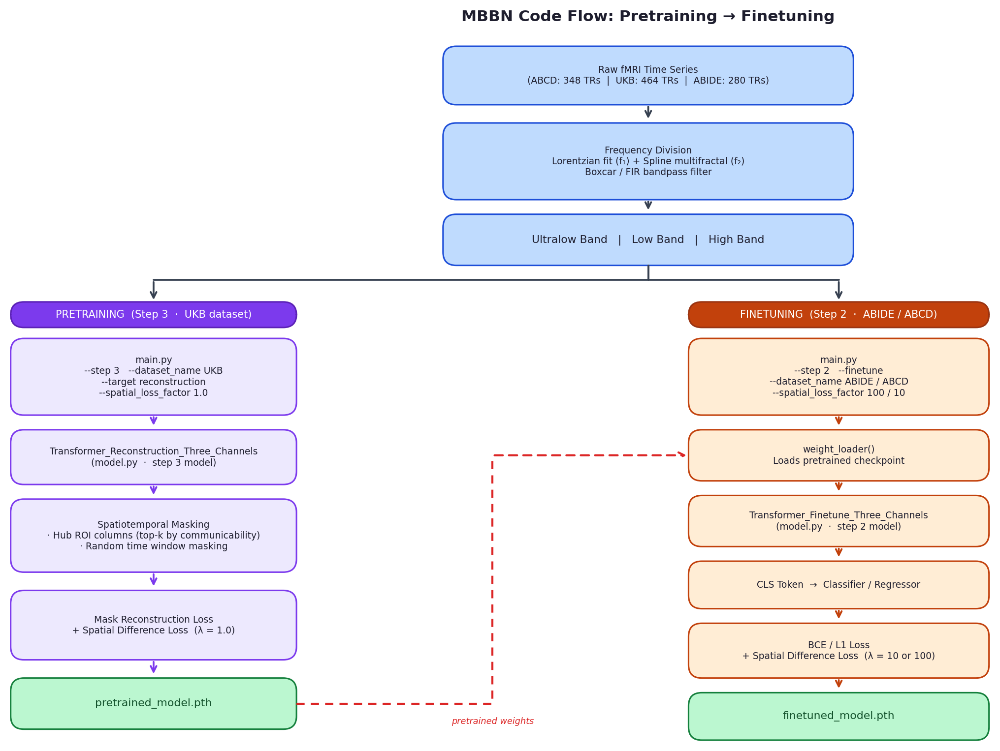

# MBBN: Multi-Band Brain Network

Official PyTorch implementation of **Multi-Band Brain Network (MBBN)**, published in *Communications Biology*. \[paper link will be added soon\]

> MBBN is a self-supervised, pre-trainable transformer for functional MRI (fMRI) that decomposes BOLD signals into three frequency bands and learns multi-scale brain dynamics through band-specific temporal–spatial modules.

---

## Overview

Standard fMRI models treat the BOLD time series as a single signal, ignoring the rich multi-scale temporal structure of neural activity. MBBN addresses this by:

1. **Frequency decomposition** — splitting each ROI's time series into *ultralow*, *low*, and *high* frequency bands using data-driven Lorentzian fitting (f₁) and spline multifractal analysis (f₂)
2. **Band-specific modules** — each band is independently processed by a BERT-style temporal encoder followed by a multi-head spatial attention module
3. **Self-supervised pretraining** — spatiotemporal masking of structurally central (high-communicability) hub ROIs and random time windows, trained with a mask reconstruction loss + spatial difference loss
4. **Interpretability** — GradCAM-style spatial attention analysis reveals band-specific brain network patterns associated with each phenotype

<p align="center">
  
</p>

---

## Results

For full quantitative results, ablation studies, and interpretability analyses, please refer to the paper.

---

## Environment

```bash
conda create -n mbbn python=3.10 -y
conda activate mbbn

pip3 install torch torchvision torchaudio --index-url https://download.pytorch.org/whl/cu114
pip install nibabel nilearn nitime timm tensorboard numpy pandas \
            wandb weightwatcher tqdm scikit-learn scikit-image \
            matplotlib transformers lmfit
```

Or use the provided script:
```bash
bash environment.sh
```

---

## Data

### Datasets
| Dataset | N | TR (s) | Task | Access |
|---------|---|--------|------|--------|
| [UK Biobank (UKB)](https://www.ukbiobank.ac.uk/) | 40,699 | 0.735 | Pretraining | Application required |
| [ABCD](https://abcdstudy.org/) | 8,833 | 0.8 | Sex / Fluid intelligence / Depression / ADHD | NDA required |
| [ABIDE I+II](http://fcon_1000.projects.nitrc.org/indi/abide/) | 141 | varies | ASD | Public |

### Atlases
| Atlas | ROIs | `--intermediate_vec` |
|-------|------|----------------------|
| HCP-MMP1 (asymmetric) | 360 | `360` |
| Schaefer 2018 (400 parcels, 7 networks) | 400 | `400` |

### ROI extraction
Use the scripts in `data_preprocess_and_load/`:
```bash
python data_preprocess_and_load/ROI_EXTRACT_UKB.py    # UKB
python data_preprocess_and_load/ROI_EXTRACT_ABIDE.py  # ABIDE
```

Metadata CSVs are expected under `data/metadata/`. See `data_preprocess_and_load/dataloaders.py` for the exact filenames.

---

## Usage

### Step 0 — Compute communicability

Structural communicability is used to identify hub ROIs for pretraining masking. Run once per atlas:

```bash
python communicability.py \
    --base_path /path/to/MBBN \
    --intermediate_vec 360   # or 400
```

Or use the SLURM script:
```bash
sbatch scripts/main_experiments/02_pretraining/compute_communicability.slurm
```

---

### Step 1 — Pretrain on UKB (`--step 3`)

```bash
python main.py \
    --base_path /path/to/MBBN \
    --step 3 \
    --dataset_name UKB \
    --target reconstruction \
    --intermediate_vec 400 \
    --num_hub_ROIs 380 \
    --spatial_loss_factor 1.0 \
    --nEpochs 1000 \
    --exp_name pretrain_UKB_Schaefer
```

```bash
sbatch scripts/main_experiments/02_pretraining/pretrain_MBBN.slurm
```

Key arguments:
| Argument | Description |
|----------|-------------|
| `--intermediate_vec` | Atlas size: `360` (HCPMMP1) or `400` (Schaefer) |
| `--num_hub_ROIs` | Number of high-communicability hub ROIs to mask |
| `--spatial_loss_factor` | λ for the spatial difference loss (UKB default: `1.0`) |

---

### Step 2 — Fine-tune on downstream dataset (`--step 2 --finetune`)

```bash
python main.py \
    --base_path /path/to/MBBN \
    --step 2 \
    --finetune \
    --pretraining_model_path /path/to/pretrained_model.pth \
    --dataset_name ABIDE \
    --target ASD \
    --intermediate_vec 360 \
    --spatial_loss_factor 100 \
    --exp_name finetune_ABIDE_ASD
```

```bash
sbatch scripts/main_experiments/03_finetuning/finetune_MBBN.slurm
```

Recommended `--spatial_loss_factor` per dataset:
| Dataset | λ |
|---------|---|
| ABIDE | 100 |
| ABCD | 10 |
| UKB | 1 |

---

### Step 3 — Train from scratch (`--step 2`, no `--finetune`)

```bash
python main.py \
    --base_path /path/to/MBBN \
    --step 2 \
    --dataset_name ABCD \
    --target sex \
    --intermediate_vec 360 \
    --spatial_loss_factor 10 \
    --exp_name from_scratch_ABCD_sex
```

```bash
sbatch scripts/main_experiments/01_from_scratch/train_MBBN_from_scratch.slurm
```

---

### Step 4 — Interpretability (GradCAM-style spatial attention)

```bash
python visualization.py \
    --base_path /path/to/MBBN \
    --dataset_name ABIDE \
    --target ASD \
    --intermediate_vec 360 \
    --model_path /path/to/finetuned_model.pth \
    --save_dir /path/to/save_dir
```

```bash
sbatch scripts/main_experiments/04_interpretability/interpretability_MBBN.slurm
```

Outputs per-band spatial attention maps (high / low / ultralow) for each subject, enabling GradCAM-style interpretation of which ROIs drove the model's predictions.

---

## Code Flow

<p align="center">
  
</p>

---

## Repository Structure

```
MBBN/
├── main.py                          # Training entry point
├── model.py                         # Model definitions
│   ├── Transformer_Finetune              # Step 1: vanilla BERT baseline
│   ├── Transformer_Finetune_Three_Channels   # Step 2: MBBN
│   └── Transformer_Reconstruction_Three_Channels  # Step 3: MBBN pretraining
├── trainer.py                       # Training / evaluation loop
├── losses.py                        # Mask loss + Spatial difference loss
├── loss_writer.py                   # Loss orchestration
├── visualization.py                 # Interpretability (GradCAM-style)
├── communicability.py               # Structural communicability computation
├── data_preprocess_and_load/
│   ├── dataloaders.py               # DataLoader factory
│   ├── datasets.py                  # Dataset classes (UKB / ABCD / ABIDE)
│   ├── ROI_EXTRACT_UKB.py
│   └── ROI_EXTRACT_ABIDE.py
├── data/
│   ├── atlas/                       # Atlas NIfTI files
│   ├── communicability/             # Precomputed hub ROI orderings
│   ├── coordinates/                 # ROI coordinate CSVs
│   └── metadata/                   # Phenotype CSVs
├── scripts/
│   ├── main_experiments/
│   │   ├── 01_from_scratch/         # SLURM: from-scratch training
│   │   ├── 02_pretraining/          # SLURM: communicability + pretrain
│   │   ├── 03_finetuning/           # SLURM: fine-tuning
│   │   └── 04_interpretability/     # SLURM: interpretability + WeightWatcher
├── docs/MBBN_procedure.png               # Architecture figure
└── docs/MBBN_code_flow.png               # Pretrain → finetune flow diagram
```

---

## Citation

If you find this work useful, please cite:

```bibtex
@article{MBBN_CommsBio,
  title   = {Multi-Band Brain Network for Multi-Scale Temporal Analysis of Functional MRI},
  author  = {Bae, Sangyoon and others},
  journal = {Communications Biology},
  year    = {2025},
  doi     = {TBD}
}
```

> **Note**: DOI and full citation will be updated upon publication. \[paper link will be added soon\]

---

## License

This project is licensed under the terms of the [LICENSE](LICENSE) file in this repository.
